# Scrapy框架之爬取城市天气预报

## 前言

### 一、概述

Scrapy，Python开发的一个快速、高层次的屏幕抓取和web抓取框架，用于抓取web站点并从页面中提取结构化的数据。Scrapy用途广泛，可以用于数据挖掘、监测和自动化测试.

其最初是为了页面抓取 (更确切来说, 网络抓取 )所设计的， 后台也应用在获取API所返回的数据(例如 Amazon Associates Web Services ) 或者通用的网络爬虫.

Scrapy吸引人的地方在于它是一个框架，任何人都可以根据需求方便的修改。它也提供了多种类型爬虫的基类，如BaseSpider、sitemap爬虫等，最新版本又提供了web2.0爬虫的支持.

### 二、Scrapy五大基本构成:

Scrapy框架主要由五大组件组成，它们分别是调度器(Scheduler)、下载器(Downloader)、爬虫（Spider）和实体管道(Item Pipeline)、Scrapy引擎(Scrapy Engine)。下面我们分别介绍各个组件的作用。

**(1)、调度器(Scheduler):**

调度器，说白了把它假设成为一个URL（抓取网页的网址或者说是链接）的优先队列，由它来决定下一个要抓取的网址是 什么，同时去除重复的网址（不做无用功）。用户可以自己的需求定制调度器。

**(2)、下载器(Downloader):**

下载器，是所有组件中负担最大的，它用于高速地下载网络上的资源。Scrapy的下载器代码不会太复杂，但效率高，主要的原因是Scrapy下载器是建立在twisted这个高效的异步模型上的(其实整个框架都在建立在这个模型上的)。

**(3)、 爬虫（Spider）:**

爬虫，是用户最关心的部份。用户定制自己的爬虫(通过定制正则表达式等语法)，用于从特定的网页中提取自己需要的信息，即所谓的实体(Item)。 用户也可以从中提取出链接,让Scrapy继续抓取下一个页面。

**(4)、 实体管道(Item Pipeline):**

实体管道，用于处理爬虫(spider)提取的实体。主要的功能是持久化实体、验证实体的有效性、清除不需要的信息。

**(5)、Scrapy引擎(Scrapy Engine):**

Scrapy引擎是整个框架的核心.它用来控制调试器、下载器、爬虫。实际上，引擎相当于计算机的CPU,它控制着整个流程。

### 三、整体架构图

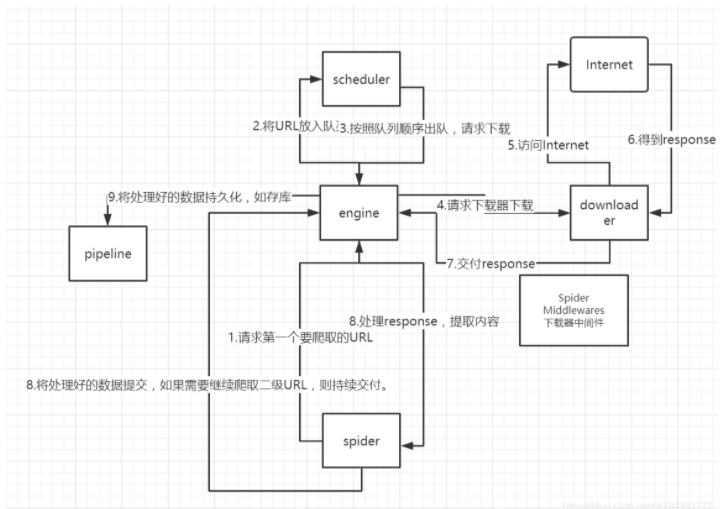

本图按顺序说明整个程序执行时候发生的顺序。

注意在调用下载器时，往往有一个下载器中间件，使下载速度提速。

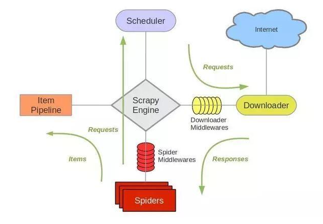

## 1.项目初始化

- 安装scrapy

   widows ，打开一个cmd，输入

	```
	 conda install scrapy
	```
	前提是你装了conda

- 创建项目

	```python
	scrapy startproject weather
	```
- 创建Spider

	```python
	scrapy genspider Cqtianqi tianqi.com
	```

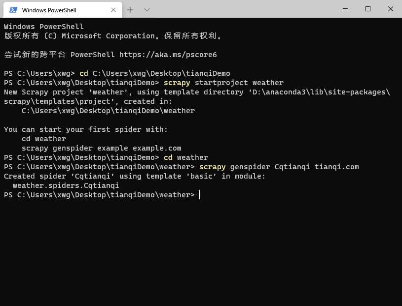

创建后目录大致页如下

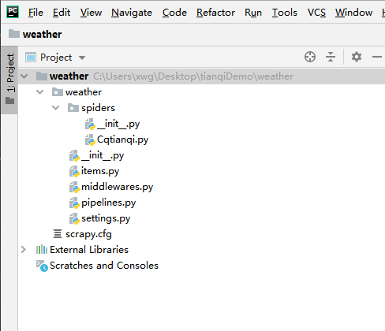

   	步骤如下         

```
-------------写爬虫----------------------
scrapy startproject 项目名

cd 项目名

scrapy genspider 爬虫名 域名  （https://www.tianqi.com/）
------------运行爬虫------------------
scrapy crawl 爬虫名


此步最后运行
最后爬虫命令为：scrapy crawl CQtianqi
```


## 2.提取数据

### 2.1 数据分析

浏览器打开(https://www.tianqi.com/chongqing/)

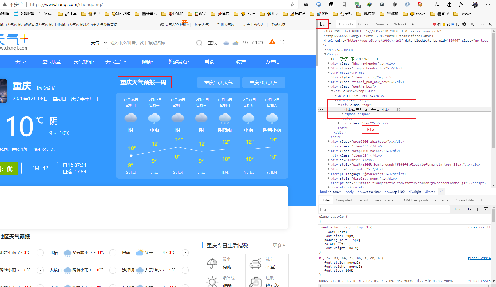

这次目的是抽取重庆及南岸区7日天气预报，截出的就是本次爬虫所需要定位的地方。

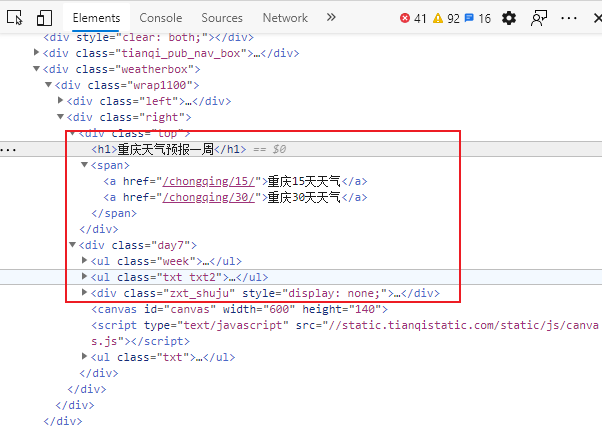

### 2.2页面解析

 XPath，全称 XML Path Language，即 XML 路径语言，它是一门在 XML 文档中查找信息的语言。最初是用来搜寻 XML 文档的，但同样适用于 HTML 文档的搜索。所以在做爬虫时完全可以使用 XPath 做相应的信息抽取。

    XPath 的选择功能十分强大，它提供了非常简洁明了的路径选择表达式。另外，它还提供了超过 100 个内建函数，用于字符串、数值、时间的匹配以及节点、序列的处理等，几乎所有想要定位的节点都可以用 XPath 来选择。

### 2.3 XPath 常用规则

| 表达式   | 描述                     |
| :------- | :----------------------- |
| nodename | 选取此节点的所有子节点   |
| /        | 从当前节点选取直接子节点 |
| //       | 从当前节点选取子孙节点   |
| .        | 选取当前节点             |
| ..       | 选取当前节点的父节点     |
| @        | 选取属性                 |

这里列出了 XPath 的常用匹配规则，示例如下：

> //title[@lang='eng']

    这是一个 XPath 规则，代表的是选择所有名称为 title，同时属性 lang 的值为 eng 的节点，后面会通过 Python 的 lxml 库，利用 XPath 进行 HTML 的解析。

### 2.4 在谷歌浏览器安装XPath插件

 在搜索店内应用搜索并安装插件

- Xpath helper

### 2.5使用Xpath解析

完成了前面的操作后，我们来看看Xpath的简单使用，我们拿一个网站来做测试。

测试页面为：https://www.tianqi.com/chongqing/

进入到页面，右键打开检查(F12)，我们观察到重庆天气预报一周是在

<div class="top">下的hi标签下的内容。所以我们可以写出Xpath的表达式：

```
//div[@class="top"]/h1
```

我们在按ctrl+shift+x打开Xpath匹配，Query下输入//div[@class="top"]/h1。Result里面输出结果。

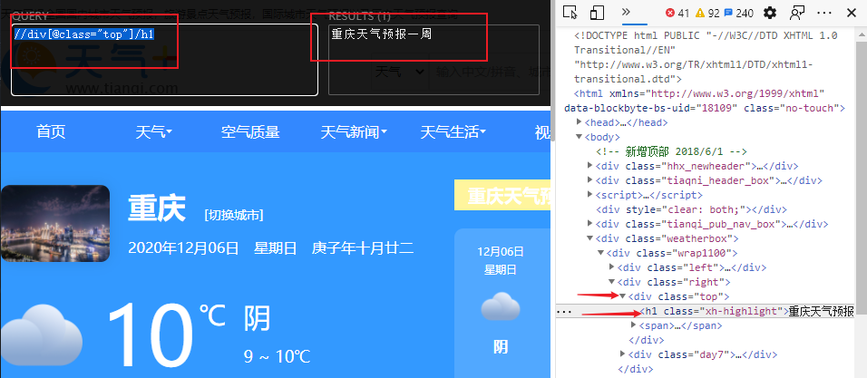

以上是Xpath的第一次尝试，如果有点懵逼，没关系，下面来讲Xpath的几个经典示例。

## 3.Xpath匹配示例

### 1.查看所有的标签

（如div、p、a、li标签等）

在一个Html页面中，如果要匹配所有的标签，可以输入：//标签名

测试页面为：https://www.tianqi.com/chongqing/

以div标签为例，//div将会匹配所有的div标签下的内容。//代表从当前节点选取子孙节点，而当前结点就是根节点，所以//div将会匹配根节点下所有div节点。可以尝试其他标签。

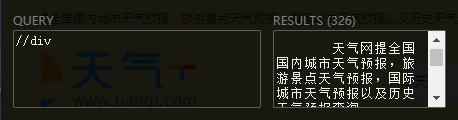


### 2.带属性值的匹配

如果我们想匹配特定的一个内容，我们可以添加属性值。属性值的格式为：标签名[@属性=“属性值”]，如图所示。如果我们想匹配class=“day7”的日期，xpath格式为：

```
//div[@class="day7"]
```

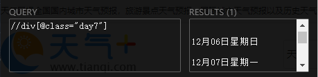


### 3.进一步匹配

如果我们只想得到日期并不想得到星期几

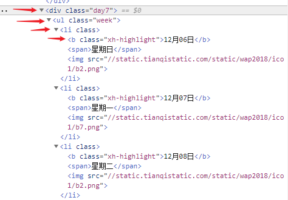

那么我们需要在上一级div的基础上进一步下探

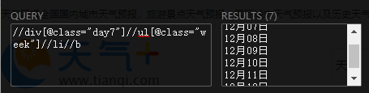


```
//div[@class="day7"]//ul[@class="week"]//li//b
```

这样就得到了只有日期的属性


### 4.xpath常用函数

**1.contains（）：匹配属性值中包含某些字符串的节点**

如下面的例子，这里的id并不一样，那么我们获取的方式可以通过：//li[contains(@id,"car_")]

<li id="car_bw" >宝马</li>

<li id="car_byd" >比亚迪</li>

**2.text（）：获取标签里的内容，作为字符串输出**

### 5.总结

**//代表从根节点向下找**

**/代表从当前结点往下找**

比如//div匹配到根下的所有div标签，//div/ul在从div标签下找ul标签

**@的使用场景 ：**

1）属性值作为条件

  //div[@class="day7"]

2）直接获取属性值

  //div[@class="day7"]//ul[@class="week"]//li//b

**获取文本内容需要加text()**

比如 //div[@class="day7"]//ul[@class="week"]//li//b ，虽然会输出a标签下的文本内容，但是这个表达式是不严谨的，如果是想抓取内容，最好写成：

```
//div[@class="day7"]//ul[@class="week"]//li//b/txt()
```

**element还是string:**

不加text()的情况或者不以@属性名结尾的情况下，返回的结果都是element，element是元素节点，如果你在python想将抓取的结果作为String输出，那么加上text()或@属性名

完成了前面的操作后，我们来看看Xpath的简单使用，我们拿一个网站来做测试。

**1）地区**

```
//div[@class="top"]//h1/text()
```

**2）当日日期**

```
//div[@class="day7"]//ul[@class="week"]//li//b/text()
```

**3）星期几**

```
//div[@class="day7"]//ul[@class="week"]//li//span/text()
```

**4）天气**

```
//div[@class="day7"]//ul[@class="txt txt2
```

**5）最高气温，最低气温**

```
//div[@class="day7"]//div[@class="zxt_shuju"]/ul//li/span/text()
//div[@class="day7"]//div[@class="zxt_shuju"]/ul//li/b/text()
```

**6）风向**

```
//div[@class="day7"]//ul[@class="txt"][1]//li/text()
```

​	接下来，定义以下存储的数据!

```
location = 地区
date = 当日日期
week = 星期几
weather = 当日天气
high_temperature = 当日最高温度
low_temperature = 当日最低温度
wind = 当日风况
```

## 3 数据抽取

item定义你要提取的内容（定义数据结构），比如我提取的内容为电影名和电影描述，我就创建2个变量。这里是7个变量的天气属性。Field方法实际上的做法是创建一个字典，给字典添加一个建，暂时不赋值，等待提取数据后再赋值。下面item的结构可以表示为：{'location':'','data':'',...,}。

修改`items.py`

```python
import scrapy
class WeatherItem(scrapy.Item):
    # define the fields for your item here like:
    # name = scrapy.Field()
    location=scrapy.Field()
    date = scrapy.Field()
    week = scrapy.Field()
    high_temperature = scrapy.Field()
    low_temperature = scrapy.Field()
    weather = scrapy.Field()
    wind = scrapy.Field()
```

###  自定义spider

scrapy自动为我们生成的CQtianqi.py需要自己添加内容

我们要写的部分是parse方法里的内容，重点在于如何写xpath

前面介绍过了Xpath

也可以参考[lxml+Xpath实现爬虫](https://blog.csdn.net/ck784101777/article/details/104291634)

引入刚刚写好的item,刚刚说了item里面创建的变量就是字典的键值，可以直接进行赋值。赋值后交给管道处理。

`CQtianqi.py`

```python

# -*- coding: utf-8 -*-
import scrapy

from weather.items import WeatherItem


class CqtianqiSpider(scrapy.Spider):
    name = 'CQtianqi'
    allowed_domains = ['tianqi.com']
    start_urls = []
    citys = ['chongqing', 'nananqu']
    for city in citys:
        start_urls.append('http://' + 'www.tianqi.com/' + city + '/')

    def parse(self, response):
        '''
        location=地区
        date = 当日日期
        week = 星期几
        wind = 当日风况
        weather = 当日天气
        high_temperature = 当日最高温度
        low_temperature = 当日最低温度
        :param response:
        :return:
        '''
        # oneweek = response.xpath('//div[@class="day7"]')
        #地区，日期，星期
        item = WeatherItem()
        location = response.xpath('//div[@class="top"]//h1/text()').extract()
        date = response.xpath('//div[@class="day7"]//ul[@class="week"]//li//b/text()').extract()
        week = response.xpath('//div[@class="day7"]//ul[@class="week"]//li//span/text()').extract()
        print(location)
        print(date)
        print(week)
        # 天气
        weather = response.xpath('//div[@class="day7"]//ul[@class="txt txt2"]//li/text()').extract()
        print(weather)
        # 最高气温，最低气温
        high_temperature = response.xpath('//div[@class="day7"]//div[@class="zxt_shuju"]/ul//li/span/text()').extract()
        low_temperature = response.xpath('//div[@class="day7"]//div[@class="zxt_shuju"]/ul//li/b/text()').extract()
        print(high_temperature)
        print(low_temperature)
        # 风向
        wind = response.xpath('//div[@class="day7"]//ul[@class="txt"][1]//li/text()').extract()
        print(wind)

        item['location'] = location
        item['date'] = date
        item['week'] = week
        item['weather'] = weather
        item['wind'] = wind
        item['high_temperature'] = high_temperature
        item['low_temperature'] = low_temperature
        yield item
```

**yield**

程序里一有个yield，比较像中断，当然中断只在CPU中发生，它的作用是移交控制权，在本程序中，我们对item封装数据后，就调用yield把控制权给管道，管道拿到处理后return返回，又回到该程序。这是对第一个yield的解释。

## 4.存储数据

### 4.1 修改

下面再看一下spdier项目的配置文件，打开文件settings.py 

BOT_NAME：项目名

USER_AGENT：默认是注释的，这个东西非常重要，如果不写很容易被判断为电脑，简单点洗一个Mozilla/5.0即可

ROBOTSTXT_OBEY：是否遵循机器人协议，默认是true，需要改为false，否则很多东西爬不了

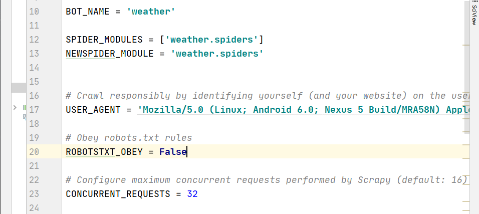

CONCURRENT_REQUESTS：最大并发数，很好理解，就是同时允许开启多少个爬虫线程

DOWNLOAD_DELAY：下载延迟时间，单位是秒，控制爬虫爬取的频率，根据你的项目调整，不要太快也不要太慢，默认是3秒，即爬一个停3秒，设置为1秒性价比较高，如果要爬取的文件较多，写零点几秒也行

COOKIES_ENABLED：是否保存COOKIES，默认关闭，开机可以记录爬取过程中的COKIE，非常好用的一个参数

DEFAULT_REQUEST_HEADERS：默认请求头，上面写了一个USER_AGENT，其实这个东西就是放在请求头里面的，这个东西可以根据你爬取的内容做相应设置。


ITEM_PIPELINES：项目管道，300为优先级，越低越爬取的优先度越高

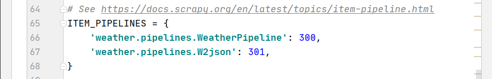

 比如我的pipelines.py里面写了两个爬虫管道，一个是爬取存txt的管道，一个存json的管道，我调整了他们的优先级，如果有爬虫数据，优先执行存文本操作。

`settings.py`

```python

# 以下直接修改
ITEM_PIPELINES = {
   'weather.pipelines.WeatherPipeline': 300,
   'weather.pipelines.W2json': 301,
}
ROBOTSTXT_OBEY = False
USER_AGENT = 'Mozilla/5.0 (Linux; Android 6.0; Nexus 5 Build/MRA58N) AppleWebKit/537.36 (KHTML, like Gecko) Chrome/68.0.3440.106 Mobile Safari/537.36'

```

### 4.2 数据存储  **交给管道输出**

管道可以处理提取的数据

修改`pipelines.py`

```python
import os,json

pathdir = os.getcwd()
class WeatherPipeline(object):
    def process_item(self, item, spider):
        # 文件存在data目录下的weather.txt文件内
        fiename = pathdir + '\\data\\weather.txt'
        # 从内存以追加的方式打开文件，并写入对应的数据
        with open(fiename, 'a', encoding='utf8') as f:
            # f.write('地区:' + item['location'] + '\n')
            for i in range(7):
                f.write('------------' + str(item['location']) + '-----------------' + '\n')
                f.write('日期:' + item['date'][i] + '\n')
                f.write('星期:' + item['week'][i] + '\n')
                f.write('最高温度:' + item['high_temperature'][i] + '\n')
                f.write('最低温度' + item['low_temperature'][i] + '\n')
                f.write('天气:' + item['weather'][i] + '\n')
                f.write('风况:' + item['wind'][i] + '\n')


        return item

class W2json(object):
    def process_item(self, item, spider):
        '''
        讲爬取的信息保存到json
        方便调用
        '''
        filename = pathdir + '\\data\\weather.json'

        # 打开json文件，向里面以dumps的方式吸入数据
        # 注意需要有一个参数ensure_ascii=False ，不然数据会直接为utf编码的方式存入比如:“/xe15”
        with open(filename, 'a', encoding='utf8') as f:
            line = json.dumps(dict(item), ensure_ascii=False) + '\n'
            f.write(line)

        return item
```


- 数据存储至txt

    1、weather\下建立data文件夹
    
    2、data\新建weather.txt


- 数据存储至json

    3、data\新建weather.json

## 5.运行爬虫

修改`_init_.py`

注意`_init_.py`位于weather下
```python
from scrapy import cmdline
cmdline.execute('scrapy crawl CQtianqi'.split())
```
运行即可


